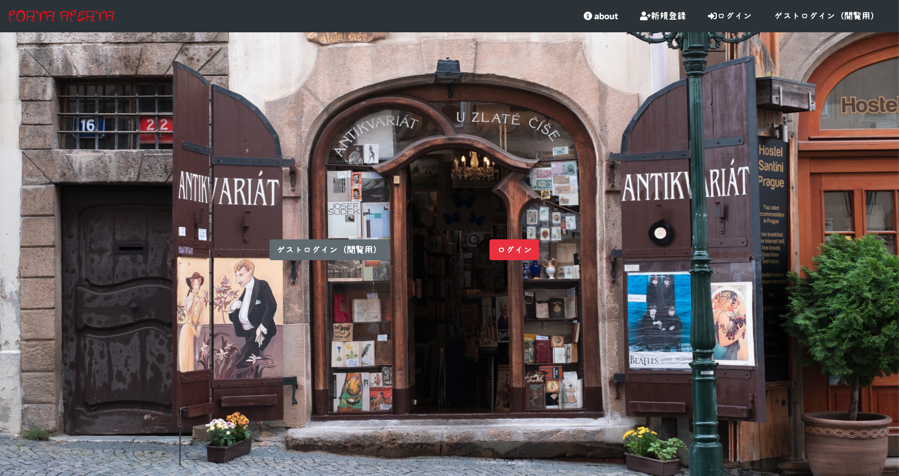

## PortaAperta

### 開発環境
- OS
Linux(Ubuntu)

- 言語
HTML,CSS,JavaScript,Ruby2.6.3,SQL,Rails6.0.3

- フレームワーク
Ruby on Rails
Bootstrap

- Railsライブラリ
Actiontext

- JSライブラリjQuery

- インフラ
AWS(EC2,RDS)

- テストフレームワーク
Rspec
- その他ツールなど
Cloud9
Slack
Zoom
VirtualBox

サービス詳細/
開発環境
サービス詳細
<コンセプト>
・多くの人の成果物を皆で使いコミュニケーションをとり
モチベーションや感想をもらい。時には参考にしてもらい
ポートフォリオ制作に役に立てば嬉しい
  
<作成したきっかけ >
・理由は、何を作るか悩み他の人のポートフォリオを参考にしようと
探したところ、中々見つからなく一つのサイトに纏まっていたら探しやすく、見つけやすいと考えたからです。
また、ポートフォリオ を製作している人達は異業種からや独学での転職を目指している人が多いと考えたので情報の交換やアドバイスなどをして、仲間を増やせたらモチベーションの維持にもつながると考えます。

開発環境
- OS
Linux(Ubuntu)

- 言語
HTML,CSS,JavaScript,Ruby,SQL

- フレームワーク
Ruby on Rails
Bootstrap

- Railsライブラリ
Actiontext

- JSライブラリjQuery

- インフラ
AWS(EC2,RDS)

- テストフレームワーク
Rspec
- その他ツールなど
Cloud9
Slack
Zoom
VirtualBox

## 使い方

- 新規登録しなくても、ゲストユーザーとしてアクセスできます。
使ってみてよかったら、新規登録してください。(ゲストユーザーの編集、削除はできません。)
## 🌐 App URL
http://prtaaperta.work/

## サイト概要
portfolioの投稿サイト

### サイトテーマ
ポートフォリオの共有して、アドバイス、コメント、参考、などをしてよりよく改善する。
未経験が挑戦する目標や参考になればいい。

### テーマを選んだ理由
ポートフォリオを作って、使ってもらったり、大勢の目に触れないのはもったいないと思うので
作って終わりでなく、使ってもらう事を目的にしたいから
### ターゲットユーザ
未経験〜
itを目指す際の、目標だったり、こんなやつを作りたいと
参考になれれば良いと考え。

### 主な利用シーン
色々な人のポートフォリオを見て、使う
未経験、駆け出しエンジニア同士の情報交換
## 設計書

### 機能一覧
https://docs.google.com/spreadsheets/d/1Ux16Of7pk0O2gQwcPCfKtup4-Ytjy4JDHUVjIll_0xQ/edit#gid=0

##名前由来
Portafolio　イタリア語が語源

Porta（運ぶ、支える、保つ　、扉、どあ）　ポルタ　イタリア語
aperta　開いた・開いた（あいた・ひらいた）　アペルト イタリア語
「扉を開く」
